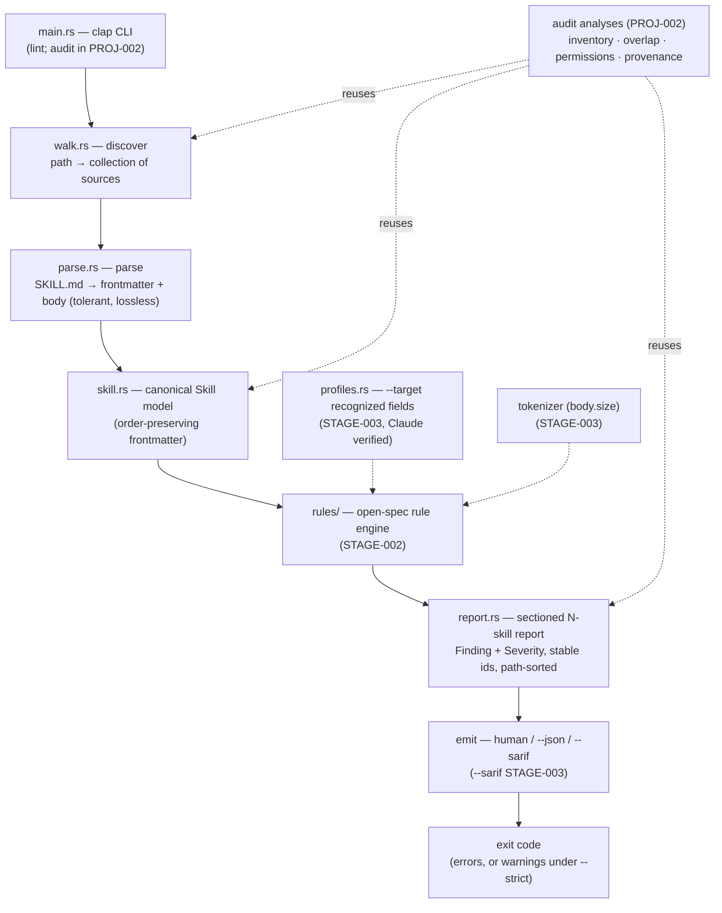

# Architecture

skillport is a single Rust static binary that validates (`lint`) and — in a
later wave — audits (`audit`) agent `SKILL.md` files. This document describes the
**substrate** built in PROJ-001 STAGE-001 and how the rule engine, CLI, and the
future `audit` command sit on top of it. It is the concrete expression of DEC-004
(collection-first, built for reuse) and DEC-005 (deterministic, stable output).

## Overview

The core is a pipeline: **discover → parse → evaluate → report**. A path is
walked into a *collection* of skill sources; each source is parsed (tolerantly,
losslessly) into a canonical `Skill`; the rule engine evaluates each skill into
`Finding`s; the findings are assembled into a **sectioned N-skill report** that a
chosen emitter renders as human text, JSON, or SARIF. Every stage is
collection-shaped from day one — linting a single file is just a collection of
size one — so PROJ-002's `audit` reuses the same discover/parse/report spine and
only adds new analyses (DEC-004).

## Components

Solid arrows = PROJ-001 lint data flow. Dotted = additive layers (STAGE-003
options and the PROJ-002 audit) that plug into the same spine without reshaping it.

| Component | File(s) | Responsibility | Stage |
|---|---|---|---|
| CLI | `main.rs` | Parse args (clap); dispatch `lint`; select target/emitter; own the exit code. | STAGE-002 (+003 flags) |
| Discover | `walk.rs` | Path → collection of skill *sources*; skip `.git`/`node_modules`/`target`; a single file → a 1-element collection. | STAGE-001 |
| Parse | `parse.rs` | Split YAML frontmatter from Markdown body; tolerant of BOM / blank lines / missing / unclosed frontmatter / CRLF. Never panics. | STAGE-001 |
| Model | `skill.rs` | Canonical, order-preserving, lossless `Skill`. | STAGE-001 |
| Report model | `report.rs` | `Finding`, `Severity`, and the sectioned N-skill `Report` with stable ids + path ordering. | STAGE-001 |
| Rule engine | `rules/` (or `lint.rs`) | Register + run open-spec rules over a `Skill` → `Finding`s. | STAGE-002 |
| Emitters | `emit/` | Render a `Report` as human / JSON / SARIF. | STAGE-002 (+SARIF 003) |
| Profiles | `profiles.rs` | `--target` recognized-field sets (Claude verified; others advisory). | STAGE-003 |

## Key Design Principles

- **Collection-first (DEC-004).** Discover always returns a collection; the report
  is always N skills with sections; every rule/finding has a **stable id**. The
  audit is an additive layer, never a refactor.
- **Tolerant, lossless parse (DEC-005).** Malformed input is a *finding*, not a
  crash or an aborted run. Frontmatter key order is preserved and nothing is
  dropped, so future normalization/round-trip work is possible.
- **Deterministic, stable output (DEC-005).** Results sorted by path; the `--json`
  / `--sarif` schemas, rule ids, and exit codes are a public contract — breaking
  any requires a MAJOR bump.
- **Only verified constraints are firm (DEC-002).** The open-spec rules are firm;
  any per-platform behavior is advisory (info) until cited from primary docs.
- **Severity discipline (DEC-003).** Errors are crisp, mechanical spec violations
  that gate CI. No heuristic is ever error-level (heuristics live in `audit`).

## Boundaries and Interfaces

- **CLI ↔ core.** `main.rs` is the only place that touches argv, stdout/stderr,
  and process exit. The core (walk/parse/model/rules/report) is a library with no
  I/O side effects beyond reading files during discovery — this keeps it unit- and
  fixture-testable and lets `audit` reuse it.
- **Rule engine ↔ report model.** Rules depend only on `Skill` + emit `Finding`s;
  they never format output. Emitters depend only on the `Report`; they never
  evaluate rules. This separation is what lets `--json`/`--sarif` be pure
  add-ons and keeps the schema stable.
- **Results vs. diagnostics.** The report goes to **stdout**; operational
  diagnostics go to **stderr**. Machine consumers parse stdout only.
- **Public contract surface** (semver-governed): CLI subcommands/flags, rule ids,
  severity taxonomy, `--json`/`--sarif` schema, exit codes. See `api-contract.md`.

## Data Flow

A typical `skillport lint ./skills --json --strict`:

1. **Discover** walks `./skills`, collecting every `SKILL.md` source (path +
   raw bytes), skipping ignored dirs → an ordered collection.
2. **Parse** each source → `Skill` (or a parse-level `Finding` if unrecoverable);
   a bad file yields a finding and the walk **continues** (DEC-005).
3. **Evaluate** each `Skill` through the rule engine (widened by `--target` if
   set) → `Finding`s with stable ids.
4. **Assemble** a `Report`: one section per skill, findings within, path-sorted.
5. **Emit** via the JSON emitter to stdout.
6. **Exit**: non-zero because `--strict` promotes warnings to failures (else
   non-zero only on an error). Zero if clean.

## Deployment Topology

A single statically-linked binary (`cargo build --release`, `strip = true`),
distributed via crates.io and GitHub releases and dropped into CI (a GitHub
Action ships in STAGE-003). No services, no database, no network at runtime.

## References

- Data model: [`./data-model.md`](./data-model.md)
- CLI + output contract: [`./api-contract.md`](./api-contract.md)
- Decisions: [`/decisions/`](../decisions/) — esp. DEC-002, DEC-003, DEC-004, DEC-005
- Rule catalog: `projects/PROJ-001-skillport-lint/stages/STAGE-002-*.md`
