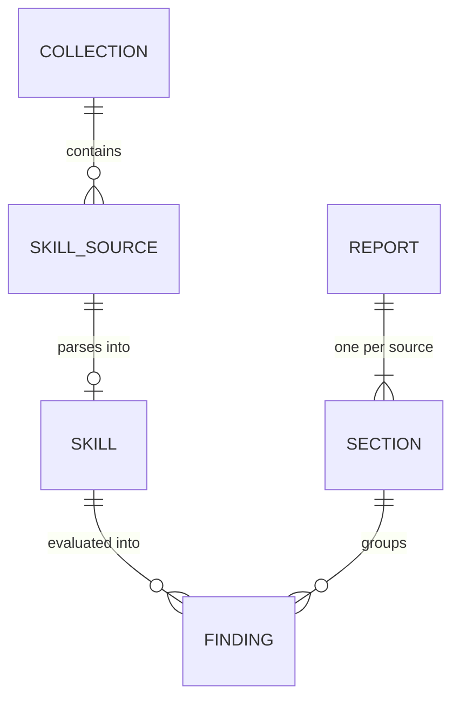

# Data Model

skillport has **no persistent database**. Its "data model" is the set of
in-memory types the substrate passes through the discover → parse → evaluate →
report pipeline. These types are the reuse contract for PROJ-002 (DEC-004), and
the `Finding` shape + rule ids are part of the public output contract (DEC-005).

> The Rust below is *indicative* — field names and exact types are settled during
> each STAGE-001 spec's design. What is load-bearing is the **shape**:
> collection-first, order-preserving frontmatter, stable-id findings, sectioned
> N-skill report.

## Entities

### Entity: `Skill` (the canonical, lossless model)

| Field | Type | Description |
|---|---|---|
| `path` | `PathBuf` | Absolute/normalized path to the `SKILL.md`. Ordering key. |
| `dir_name` | `Option<String>` | Parent directory name (for `name.dir-match`). |
| `frontmatter` | order-preserving map `String → YamlValue` | Parsed YAML frontmatter. **Key order preserved**, values kept as typed YAML (string/seq/map/…) so rules can check types (e.g. `metadata` is a map, `allowed-tools` is a string vs. list). |
| `body` | `String` | The Markdown body after the frontmatter block, verbatim. |
| `raw` | `String` (or byte-length + retained source) | The original file content, so parse is lossless / round-trippable. |

- Order preservation ⇒ an index-map-style structure, not `HashMap`.
- The parser never discards unknown keys — `frontmatter.unknown` is a *rule*
  (info), not a parse-time drop.

### Entity: `SkillSource` / parse outcome

Discovery yields sources; parsing each yields **either** a `Skill` **or** a
parse-level finding — a malformed file must not abort the run (DEC-005). Modeled
as a per-source result, e.g. `Result<Skill, ParseError>` where `ParseError`
carries enough to emit a `frontmatter.missing`-class finding with the path.

### Entity: `Finding` (public output contract)

| Field | Type | Nullable | Description |
|---|---|---|---|
| `rule` | `&'static str` (stable id) | no | e.g. `name.charset`. Never renamed without a MAJOR bump (DEC-005). |
| `severity` | `Severity` = `Error \| Warning \| Info` | no | DEC-003 taxonomy. |
| `message` | `String` | no | Human-readable explanation. |
| `path` | `PathBuf` | no | Which skill (sorting + JSON/SARIF location). |
| `field` | `Option<String>` | yes | Frontmatter key the finding concerns, when applicable. |
| `line` / `span` | `Option<…>` | yes | Source location where cheaply available (SARIF benefits; may be coarse initially). |

### Entity: `Severity`

`Error` (crisp spec violation; gates CI) · `Warning` (recommended / likely-wrong;
fails CI only under `--strict`) · `Info` (advisory; also the ceiling for any
unverified per-platform behavior, DEC-002, and for all heuristics, DEC-003).

### Entity: `Report` + `Section` (sectioned, N-skill)

| Field | Type | Description |
|---|---|---|
| `Report.sections` | `Vec<Section>` | One per skill source, **sorted by path** (DEC-005). |
| `Report.summary` | counts | totals by severity across all sections (drives exit code + human summary). |
| `Section.path` | `PathBuf` | The skill this section is about. |
| `Section.findings` | `Vec<Finding>` | Findings for that skill (deterministically ordered — e.g. by rule id then discovery order). |

This is the type PROJ-002's `audit` extends (adding collection-level sections
like overlap/permissions/provenance) rather than replacing.

## Schema Evolution

- **Rule ids, `Finding`/`Report` JSON shape, severity names, exit codes** are the
  versioned public contract. Additive change (new rule, new optional field) = MINOR;
  removing/renaming a rule id or changing a field's meaning/exit semantics = MAJOR
  (`.repo-context.yaml` `version.scheme: semver`; DEC-005).
- The `--json` output should carry a `schema`/tool-version marker so CI consumers
  can pin it. (Exact envelope settled in the STAGE-002 emitter spec.)

## Indexes / Ordering

No indexes (no store). **Ordering is the correctness property**: sections sorted
by path, findings within a section deterministically ordered — identical input
must produce byte-identical output across runs and machines (DEC-005).

## Data Lifecycle

All data is ephemeral and per-invocation: read files → build the model → emit →
exit. Nothing is written or retained. (PROJ-002 introduces the **only** persisted
artifact: a hash-anchored `.skillport.lock` for provenance/drift — DEC-006 — out
of scope for PROJ-001.)
